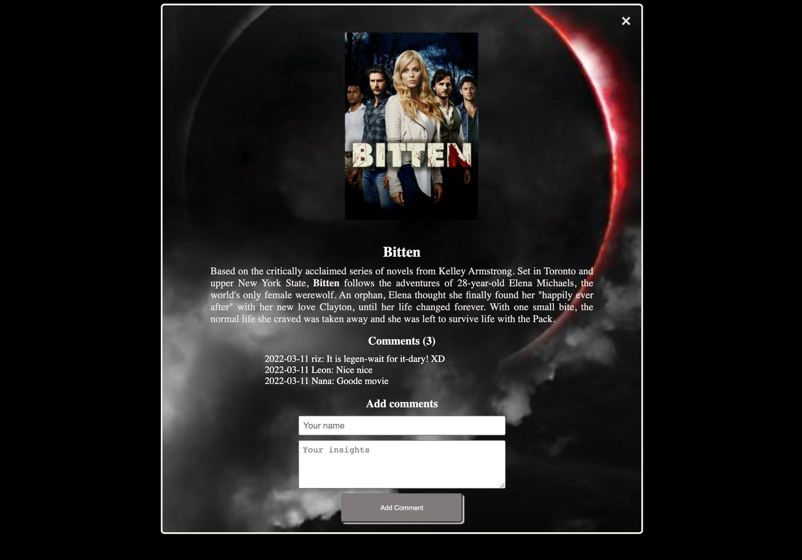

# The Capstone Project JS
> This application displays a list of shows. The user is able to like any of the movies, and also read more about each movie once he clicks on the "comments" button. Also, the user is able to leave a comment about any of the movies.


## Built With
- HTML
- CSS
- JavaScript
- Webpack
<!-- ## Live Demo -->
<!-- ## Video Demo -->
## Getting Started
To get a local copy up and running follow these simple example steps.
- clone the repository by running
``` git clone https://github.com/cynthiainga/JavaScript-group-capstone.git ```
- navigate to the folder
``` cd JavaScript-group-capstone ```
- Install packages
``` npm install ```
- Run the app
``` npm start ```
## Prerequisites
- Linters
- GitHub Flow
- Javascript
- WEBPACK
- Jest
- Babel
### Run tests
Run the test
`npm run test`
## Authors
:bust_in_silhouette: **Author 1: Acholah Lynette**
- GitHub: [@iLynette](https://github.com/iLynette)
- Twitter: [@acholah_lynette](https://twitter.com/acholah_lynette)
- LinkedIn: [acholah lynette](https://www.linkedin.com/in/lynette-acholah/)

:bust_in_silhouette: **Author 2: Cynthia Inga**
- GitHub: [@cynthiainga](https://github.com/cynthiainga)
- LinkedIn: [LinkedIn](https://www.linkedin.com/in/cynthia-inga7/)
- Twitter: [@CynthiaInga_C](https://twitter.com/CynthiaInga_C)

## :handshake: Contributing
Contributions, issues, and feature requests are welcome!
Feel free to check the [issues page](../../issues/).
## Show your support
Give a :star:️ if you like this project!
## :memo: License
This project is [MIT](./MIT.md) licensed.